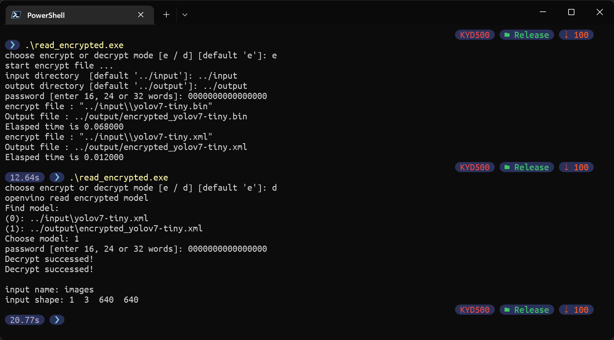

# Using Encrypted Models with OpenVINO
This repository contains
1) encrypt openvino IR model
2) using encrypted models with OpenVINO

## Dependency
[cryptopp](https://github.com/weidai11/cryptopp)

[openvino 2022.1.0](https://registrationcenter-download.intel.com/akdlm/irc_nas/18618/w_openvino_toolkit_p_2022.1.0.643_offline.exe)

place dependency (bin, lib, include) into external folder

## Usage
1) build solution
2) place openvino IR model (.xml & .bin) into folder
3) run .exe and follow the instruction

example:

   
